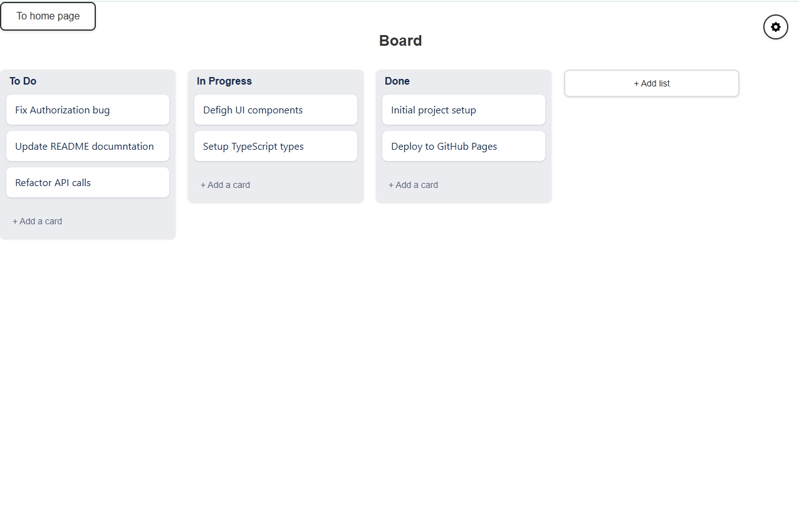
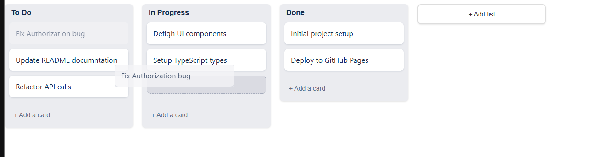

# 📋 Kanban Board (Trello Clone)


### [🔴 LIVE DEMO: Click to Open App](https://gampadich.github.io/trello/)

A powerful, strictly typed task management application. Built to demonstrate complex state management and high-performance drag-and-drop interactions using React and TypeScript.

---

## 🖼️ Preview



*Interactive Drag & Drop workflow:*


---

## 🚀 Key Features

- **⚡ High Performance:** Powered by Vite for instant HMR.
- **🛡️ Strict Typing:** 100% TypeScript coverage for robustness and maintainability.
- **✋ Drag & Drop:** Smooth reordering of tasks and columns.
- **✨ Dynamic UI:** Create, rename, and delete columns/cards on the fly.
- **🔐 Secure Auth:** Implements protected routes and JWT handling (demo mode).

## 🛠️ Technical Stack

- **Framework:** React 18
- **Language:** TypeScript
- **Bundler:** Vite
- **Styling:** CSS Modules / Styled Components
- **Architecture:** Component-based with optimized rendering

---

## ⚙️ How to Run Locally

If you want to test the code on your machine, follow these steps:

### 1. Clone the repository
```bash
git clone [https://github.com/Gampadich/trello.git](https://github.com/Gampadich/trello.git)
2. Install dependencies
Navigate to the project folder and install the required packages:

Bash
cd trello
npm install
3. Start Development Server
Run the app in development mode:

Bash
npm start
```

👨‍💻 Author
Designed & Developed by Gampadich